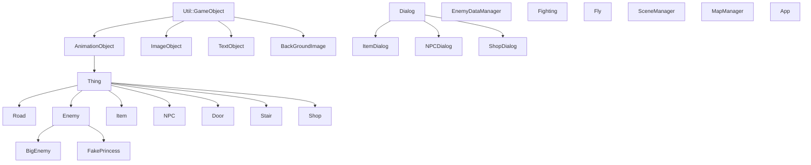

# 2026 OOPL Final Report

## 組別資訊
- 組別：48
- 組員：111310452 黃安華、113590039 許兆雲 
- 復刻遊戲：Angry Birds

## 專案簡介
### 遊戲簡介
- 我們剛開始沒有特別想復刻哪個遊戲的想法，於是就看了助教提供之前幾屆的紀錄，因為我們都有玩過、比較了解的遊戲比較少，當時考慮的是冰火姊弟、Angry Birds 和我想到的 psp 遊戲 Patapon 。
- 而在與助教溝通之後，因為 Patapon 是音樂遊戲，在 C++ 和 PTSD 框架下會碰到更多問題 (音訊與鍵盤輸入同步問題、特效動畫等) 助教也不一定能協助解決，我們判斷綜合實力比較不足就放棄了，在剩下兩個選項中，因為比較想要試試看能不能用 C++ 去實作需要物理計算的遊戲，最後選擇了 Angry Birds 的初代作品。

#### 更動 (與原作不同處)
- **關卡**：這次製作的 Angry Birds 是第一個世界的前 10 關，其中沒有包含第一關的漫畫和後面世界關卡的 UI ，選擇方面改為只顯示了製作好的 10 關。
- **場景**：原作的場景分為：背景圖、樹木、草地、和土地，但受限於 C++ 與 PTSD 的開發環境，若是全部分開同時讀取將會有嚴重卡頓的情況，因此更改為單純一張背景圖包含所有的場景，並在滑動時以同一張圖連續補上的方法作為替代。
- **縮放**：延續場景的問題，縮放時不會根據螢幕大小去補上 y 軸上的空白，而只有 x 軸上的延伸。
### 

### 組別分工 

#### 概略分工內容
|人員|工作|
|----|----|
|111310452 黃安華| 專案管理、系統架構設計、物理引擎 |
|113590039 許兆雲| 關卡系統開發(建置、結算)、遊戲介面與視覺效果實作 |

#### 看板
為了避免專案後期出現進度失控的情況，團隊使用 GitHub Project Task Board 管理所有開發任務。每項工作都會依照目前進度放入不同欄位，例如開發中（In Progress）、審查中（Reviewing）或暫緩處理（Postponed），讓團隊能即時掌握開發狀況並調整排程。

同時，我們透過 P0、P1、P2 優先級制度管理功能需求。當開發時間不足時，會優先確保 P0 核心功能完成，再逐步實作 P1 與 P2 功能，以降低專案風險。

透過這套管理方式，團隊成功將遊戲物理模組與 Gameplay 模組分開開發，使各成員能平行作業，在提升開發效率的同時，也降低了程式碼耦合度與後續維護成本。

細部協作內容可參考以下任務看板
|看板分頁|功能|
|----|----|
| **[Task Board](https://github.com/users/Annie04082020/projects/3/views/1)**| Issue 狀態 |
| **[Overview](https://github.com/users/Annie04082020/projects/3/views/2)** | Issue 分工 |
| **[Timeline](https://github.com/users/Annie04082020/projects/3/views/6)** | 開發時間軸 (甘特圖) |
| **[Current Progress](https://github.com/users/Annie04082020/projects/3/views/9)**| 列出各狀態 Issue |
 

## 遊戲介紹
### 遊戲規則
- **開發模式** - 按鍵
  - F? - 顯示碰撞箱
  - P - 暫停動畫
  - L - 播放 15 ms 
  - C - 直接完成遊戲結束此關卡
  - Esc - 退出遊戲

- **攻擊規則**
  - 鳥攻擊豬
    - 傷害 = 勇者攻擊力 - 敵人防禦力
    - 特殊條件
      - 如果傷害 == 0 - 傷害 = 1
      - 會有（敵人敏捷）%的機會被敵人迴避攻擊

### 遊戲畫面
|   階段   |                        遊戲畫面                        |
|:------:|:--------------------------------------------------:|
|  開始畫面  |    |
|  關卡選擇畫面  |    |
|  關卡內設定畫面  |    |
|  第一關畫面  |    |
|  第二關畫面  |    |
|  第三關畫面  |    |
|  第四關畫面  |    |
|  第五關畫面  |    |
|  第六關畫面  |    |
|  第七關畫面  |    |
|  第八關畫面  |    |
|  第九關畫面  |    |
|  第十關畫面  |    |
| 失敗結束畫面 |  |
| 勝利結束畫面 |  |

## 程式設計
### 程式架構

以下的點代表繼承、數字代表詳細解釋
- `Util::GameObject` - PTSD中的遊戲物件
  - `AnimationObject` - 動畫呈現的遊戲物件
    - `Thing` - 基礎地圖物件
      - `Road` - 地圖上的路跟牆
      - `Enemy` - 地圖上的敵人
        - `BigEnemy` - 地圖上的巨大敵人
        - `FakePrincess` - 地圖上的假公主
      - `Item` - 地圖上的道具
      - `NPC` - 地圖上的NPC
      - `Door` - 地圖上的門
      - `Stair` - 地圖上的樓梯和特殊樓梯
      - `Shop` - 地圖上的商店
  - `ImageObject` - 圖片呈現的遊戲物件
  - `TextObject` - 文字呈現的遊戲物件
  - `BackgroundImage` - 背景圖片 - 內涵切換背景的函式
- `Dialog` - 基礎對話框物件
  - `ItemDialog` - 獲得道具的對話框（可能會被NPC觸發）
  - `NPCDialog` - 跟NPC對話的對話框
  - `ShopDialog` - 商店購物的對話框
- `EnemyDataManager` - 查看敵人資料的介面
  1. 使用`EnemyData`複製一頁三個敵人資訊
- `Fighting` - 戰鬥介面
- `Fly` - 飛行介面
- `SceneManager` - 場景控制
- `MapManager` - 地圖控制、勇者觸碰其他物體
- `App` - 主遊戲架構

### 程式技術

- **場景管理**
- **物件與場景縮放**
- **重力模擬**
- **物理碰撞機制**
- **傷害計算與累積狀態變化**
- **關卡生成與管理**
  - 使用 JSON 作為關卡資料格式，建立完整的關卡解析與動態生成系統。
    - 例如：關卡編號、關卡名稱、背景圖片、鳥類數量、群組調整以及物件資料都能透過 JSON 進行設定。
  - 建立 `LevelParser::Parse` 函式負責解析 JSON 檔案，讀取各種關卡資訊。
  - 在 `GameScene::LoadLevel` 中協調整體關卡載入流程。
    - 例如：重置相機、呼叫 `LevelManager::LoadLevel`、建立物理世界、計算地面高度與同步控制器。
  - 地圖中的所有物件皆由 JSON 的 `objects` 陣列讀取。
    - 每個物件都包含類型、位置、縮放、旋轉與圖片 ID 等資訊。
  - 使用工廠模式根據物件資料動態生成對應的 `Character` 實例，提升系統擴充性與維護性。

- **分數計算系統**
  - 建立基於物理碰撞與角色摧毀狀態的動態計分系統。
  - 在 `Scene::Update` 中持續遍歷所有場景物件，檢查角色生命值是否小於等於 0。
  - 根據不同物件類型給予不同分數。
    - 例如：豬被消滅時加 100 分、環境方塊被摧毀時加 10 分。
  - 為避免重複加分，使用 `SetDestroyed(true)` 標記已計分物件。
    - 這樣可以避免物件在每一幀更新時重複累加分數。
  - 將總分儲存在 `Scene` 類別中的 `m_Score` 成員變數，方便 UI 與遊戲流程讀取。

- **遊戲介面按鈕**
  - 建立遊戲 HUD 與按鈕管理系統，負責遊戲中的互動介面。
  - 在 `GameScene::BuildLevelHud` 中建立各種按鈕。
    - 例如：暫停按鈕、重新開始按鈕、關卡選擇按鈕與靜音按鈕。
  - 每個按鈕皆透過 `SetOnClickFunction` 設定回調函式。
    - 例如：暫停按鈕會觸發 `TogglePauseMenu()`，重新開始按鈕則會呼叫 `m_OnRestartLevel`。
  - 使用 `App` 類別中的狀態機管理場景切換。
    - `GameScene` 會透過回調函式通知 `App` 執行狀態變更，例如重新開始關卡或回到關卡選擇畫面。
  - 建立完整的暫停選單系統。
    - 包含繼續遊戲、重新開始、關卡選擇與靜音功能。
  - 使用 `SetPauseMenuVisible` 控制暫停選單與覆蓋層的顯示與隱藏。

## 結語
### 問題與解決方法

### 自評
| 項次 | 項目                      | 完成 |
|:--:|-------------------------|:--:|
| 1  | 完成專案權限改為 public         | V  |
| 2  | 具有 debug mode 的功能       | ?  |
| 3  | 解決專案上所有 Memory Leak 的問題 | ?  |
| 4  | 報告中沒有任何錯字，以及沒有任何一項遺漏    | V  |
| 5  | 報告至少保持基本的美感，人類可讀        | V  |

### 心得
- **111310452 黃安華**
  - 123
  - 123
  - 123
- **113590039 許兆雲**
  - 123
  - 123
  - 123

### 貢獻比例

<table>
  <thead>
    <tr>
      <th align="center">組員</th>
      <th align="center">工作內容</th>
      <th align="center">實作模組與系統邏輯</th>
      <th align="center">貢獻度</th>
    </tr>
  </thead>
  <tbody>
    <tr>
      <td rowspan="3" align="center">111310452 黃安華</td>
      <td>專案管理</td>
      <td>數位看板管理與 Git 工作流建置</td>
      <td rowspan="3" align="center">60%</td>
    </tr>
    <tr>
      <td>物件相依與架構設計</td>
      <td>底層系統架構與物件解耦設計</td>
    </tr>
    <tr>
      <td>物理模擬與碰撞系統</td>
      <td>多邊形物理模擬與 SAT 碰撞引擎</td>
    </tr>
    <tr>
      <td rowspan="3" align="center">113590039 許兆雲</td>
      <td>關卡生成與管理</td>
      <td>關卡資料解析與動態物件生成驅動器</td>
      <td rowspan="3" align="center">40%</td>
    </tr>
    <tr>
      <td>分數計算系統</td>
      <td>基於物理衝量之動態計分與空間 UI 系統</td>
    </tr>
    <tr>
      <td>遊戲介面</td>
      <td>遊戲狀態機與互動介面控制、遊戲特效、遊戲音效</td>
    </tr>
  </tbody>
</table>
