# 2026 OOPL Final Report

## 組別資訊
- 組別：48
- 組員：111310452 黃安華、113590039 許兆雲 
- 復刻遊戲：Angry Birds

## 專案簡介
### 遊戲簡介
- 我們剛開始沒有特別想復刻哪個遊戲的想法，於是就看了助教提供之前幾屆的紀錄，因為我們都有玩過、比較了解的遊戲比較少，當時考慮的是冰火姊弟、Angry Birds 和我想到的 psp 遊戲 Patapon 。
- 而在與助教溝通之後，因為 Patapon 是音樂遊戲，在 C++ 和 PTSD 框架下會碰到更多問題 (音訊與鍵盤輸入同步問題、特效動畫等) 助教也不一定能協助解決，我們判斷綜合實力比較不足就放棄了，在剩下兩個選項中，因為比較想要試試看能不能用 C++ 去實作需要物理計算的遊戲，最後選擇了 Angry Birds 的初代作品。

#### 更動 (與原作不同處)
- **關卡**：這次製作的 Angry Birds 是第一個世界的前 10 關，其中沒有包含第一關的漫畫和後面世界關卡的 UI ，選擇方面改為只顯示了製作好的 10 關。
- **場景**：原作的場景分為：背景圖、樹木、草地、和土地，但受限於 C++ 與 PTSD 的開發環境，若是全部分開同時讀取將會有嚴重卡頓的情況(同時讀取、縮放、滾動渲染數張圖片)，因此更改為單純一張背景圖包含所有的場景，並在滑動時以同一張圖連續補上的方法作為替代。
- **縮放**：延續場景的問題，縮放時不會根據螢幕大小去補上 y 軸上的空白，而只有 x 軸上的延伸。
### 

### 組別分工 

#### 概略分工內容
|人員|工作|
|----|----|
|111310452 黃安華| 專案管理、系統架構設計、物理引擎 |
|113590039 許兆雲| 關卡系統開發(建置、結算)、遊戲介面與視覺效果實作 |

#### 看板
為了避免專案後期出現進度失控的情況，團隊使用 GitHub Project Task Board 管理所有開發任務。每項工作都會依照目前進度放入不同欄位，例如開發中（In Progress）、審查中（Reviewing）或暫緩處理（Postponed），讓團隊能即時掌握開發狀況並調整排程。

同時，我們透過 P0、P1、P2 優先級制度管理功能需求。當開發時間不足時，會優先確保 P0 核心功能完成，再逐步實作 P1 與 P2 功能，以降低專案風險。

透過這套管理方式，團隊成功將遊戲物理模組與 Gameplay 模組分開開發，使各成員能平行作業，在提升開發效率的同時，也降低了程式碼耦合度與後續維護成本。

細部協作內容可參考以下任務看板
|看板分頁|功能|
|----|----|
| **[Task Board](https://github.com/users/Annie04082020/projects/3/views/1)**| Issue 狀態 |
| **[Overview](https://github.com/users/Annie04082020/projects/3/views/2)** | Issue 分工 |
| **[Timeline](https://github.com/users/Annie04082020/projects/3/views/6)** | 開發時間軸 (甘特圖) |
| **[Current Progress](https://github.com/users/Annie04082020/projects/3/views/9)**| 列出各狀態 Issue |
 

## 遊戲介紹
### 遊戲操作與開發者模式
- **基礎操作**
  - **滑鼠左鍵拖曳 (彈弓)**：按住彈弓上的鳥類向後拖曳，瞄準後放開即可發射。
  - **滑鼠左鍵拖曳 (畫面)**：在畫面空白處按住拖拉，可以平移相機視角。
  - **滑鼠滾輪**：以滑鼠游標為中心，動態放大或縮小遊戲畫面。
- **開發者除錯模式 (Debug Keys)**
  - `F1` - 顯示 / 隱藏物理碰撞箱 (Debug Draw)
  - `P` - 暫停 / 恢復物理引擎模擬
  - `L` - 在物理暫停時，手動步進單幀物理模擬 (單步執行)
  - `C` - 直接消滅所有小豬 (快速觸發遊戲勝利結算)
  - `Esc` - 退出遊戲

### 遊戲規則與勝負判定
- **核心玩法**
  - 玩家需利用彈弓發射不同特性的鳥類，破壞由木頭、石頭、冰塊組成的建築結構，並藉由物理撞擊消滅躲藏在其中的小豬。
  - 利用不同材質土塊的物理特性（摩擦力、重量、抗打擊能力），引發連鎖反應與坍塌來造成最大破壞。
- **勝負條件**
  - **勝利 (Win)**：在鳥類用盡之前，消滅關卡內**所有的小豬**。
  - **失敗 (Lose)**：所有鳥類全數發射完畢，且畫面上的物件皆停止運動後，仍有**存活的小豬**。
- **計分規則**
  - **消滅小豬**：每隻 5000 分。
  - **剩餘鳥類獎勵**：過關後，彈弓上未使用的鳥類每隻可額外獲得 10000 分。
  - **破壞環境物件**：依據土塊材質給予不同分數。例如徹底摧毀木頭可得 900 分、石頭 1300 分、冰塊 500 分（此外在物件受損過程中，也會根據傷害比例給予對應的階段性分數）。
  - 所有分數參數皆可透過 `scoring_config.json` 外部設定檔進行動態調整，方便關卡難度平衡與設計。

### 遊戲畫面
|   階段   |                        遊戲畫面                        |
|:------:|:--------------------------------------------------:|
|  過場畫面  |  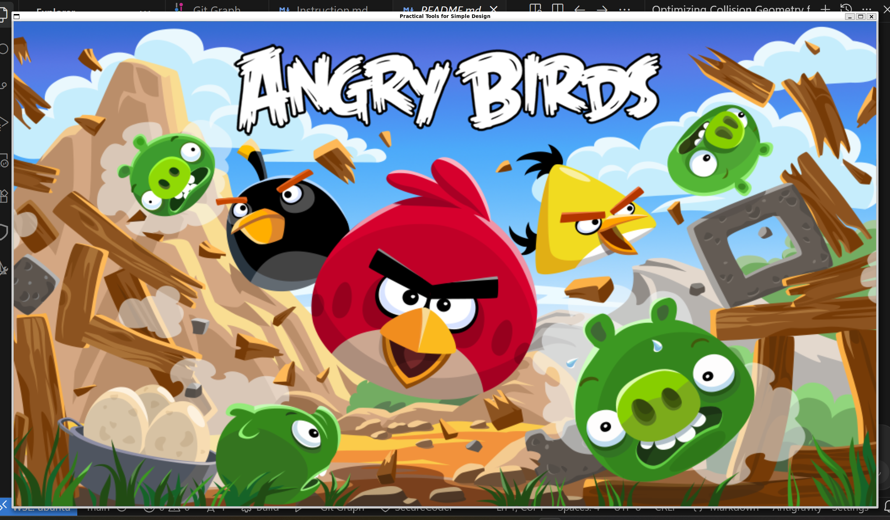  |
|  開始畫面  |  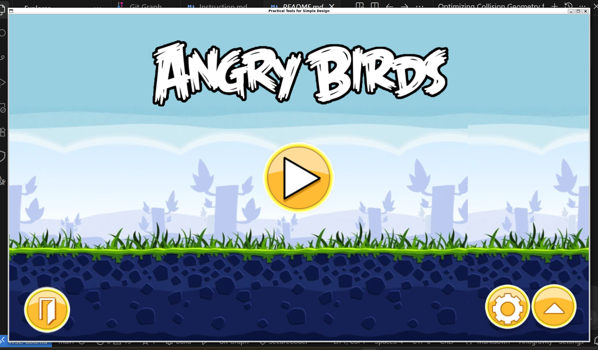  |
|  關卡選擇畫面  |  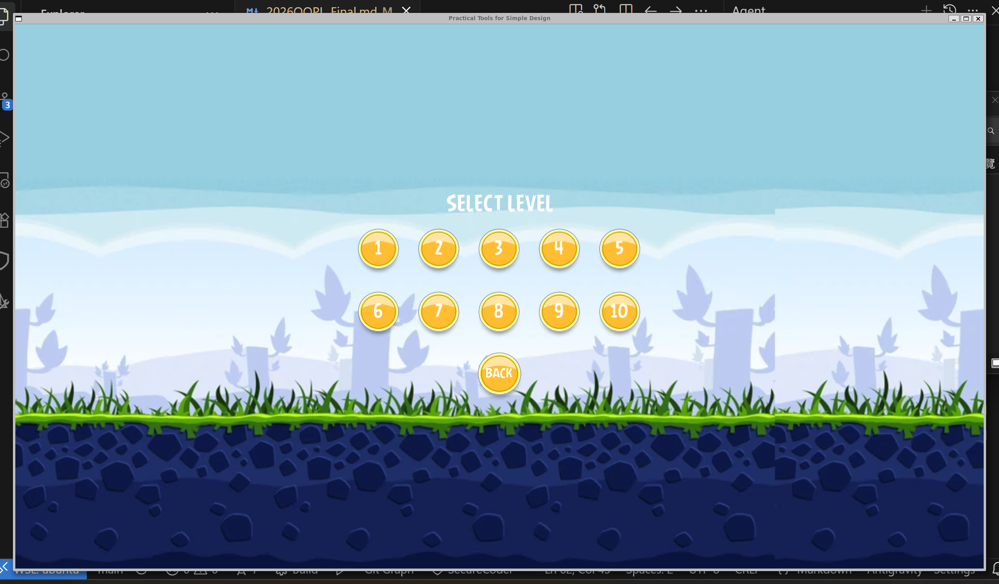  |
|  關卡內選單  |  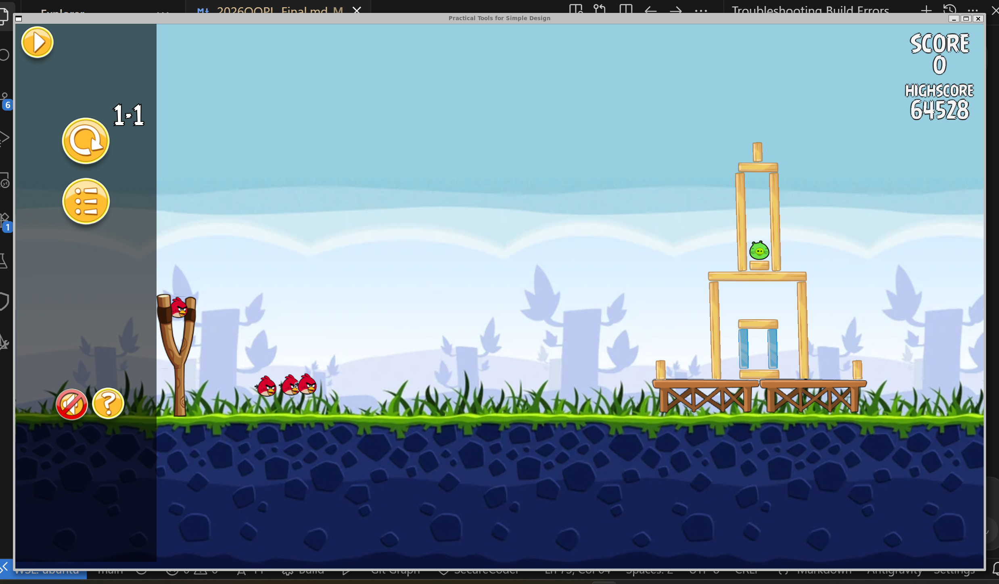  |
|  第一關畫面  |  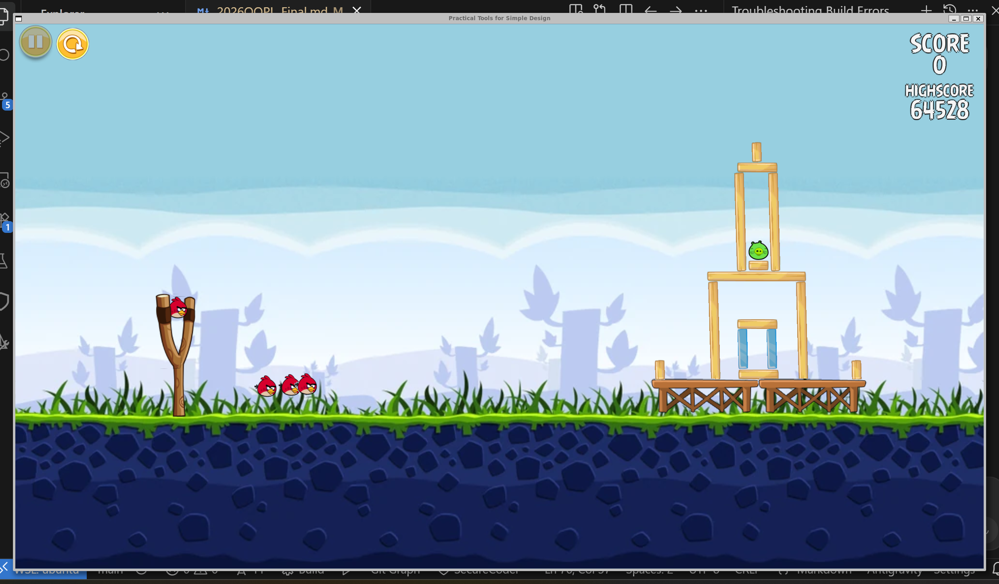  |
|  第二關畫面  |  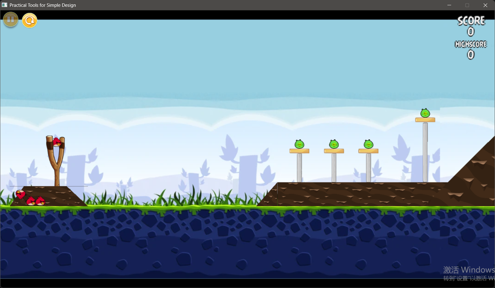  |
|  第三關畫面  |  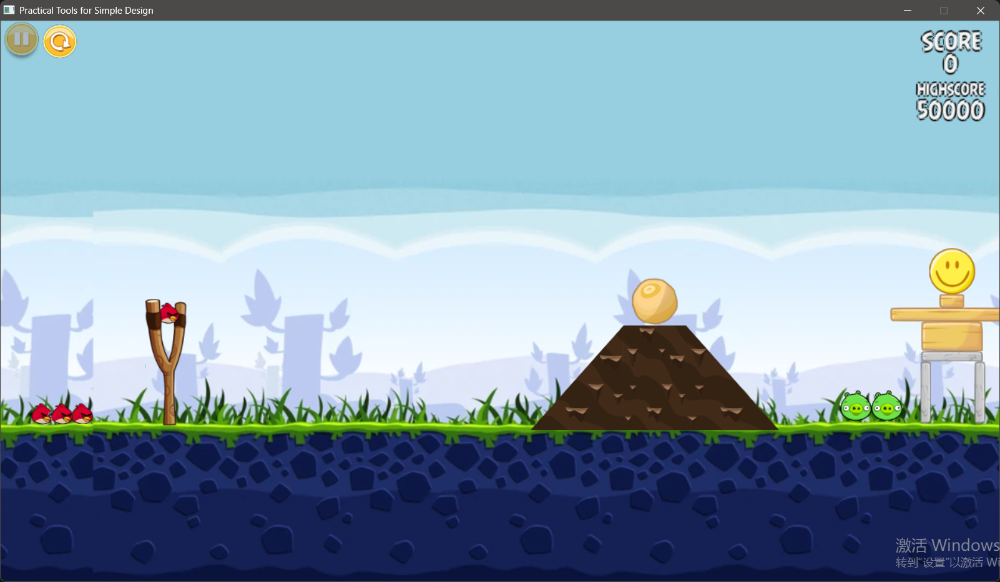  |
|  第四關畫面  |  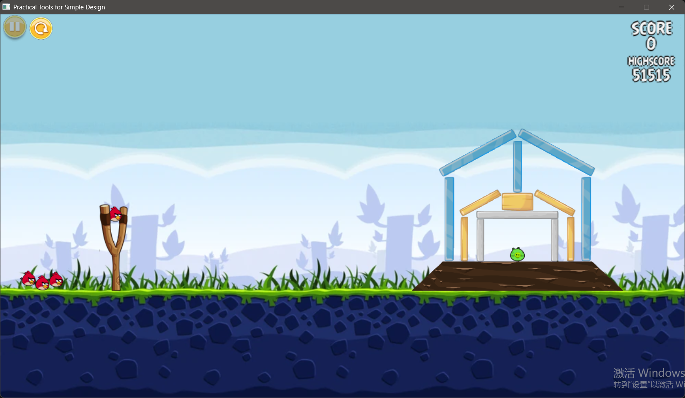  |
|  第五關畫面  |  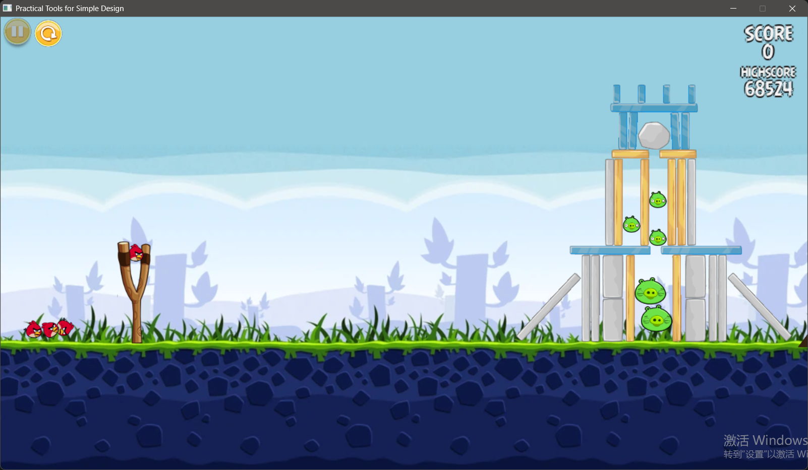  |
|  第六關畫面  |  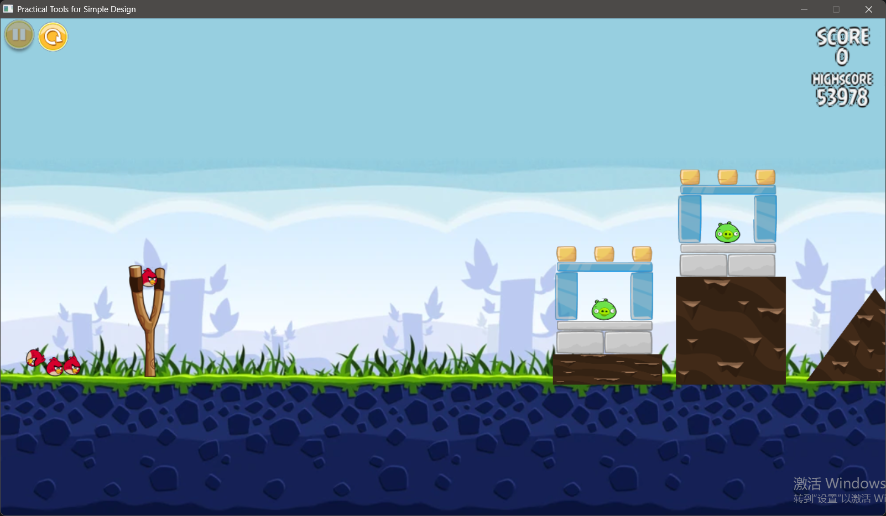  |
|  第七關畫面  |  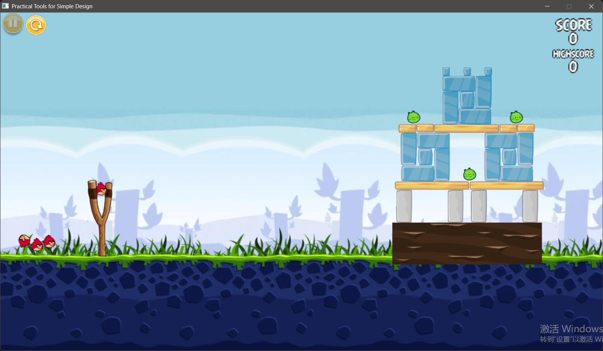  |
|  第八關畫面  |  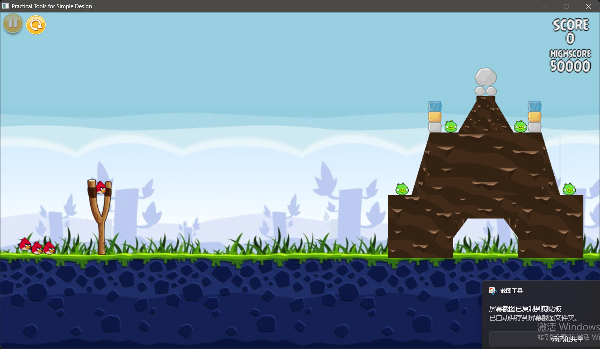  |
|  第九關畫面  |  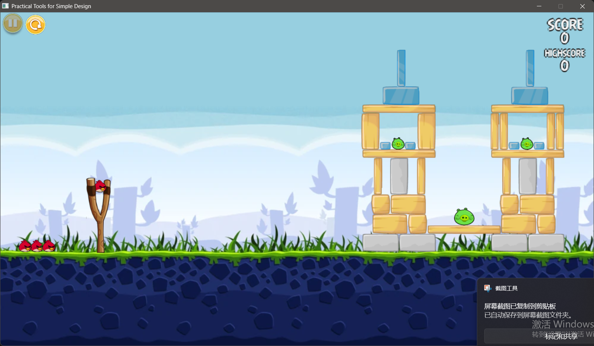  |
|  第十關畫面  |  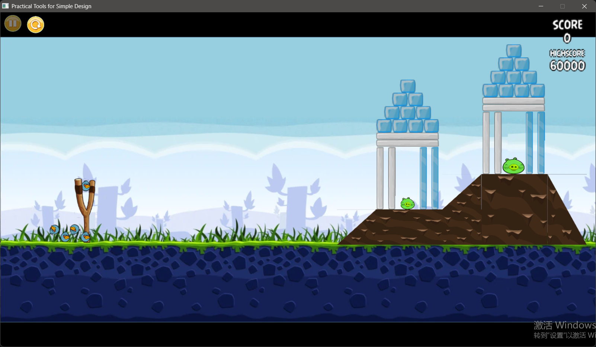  |
| 失敗結束畫面 | 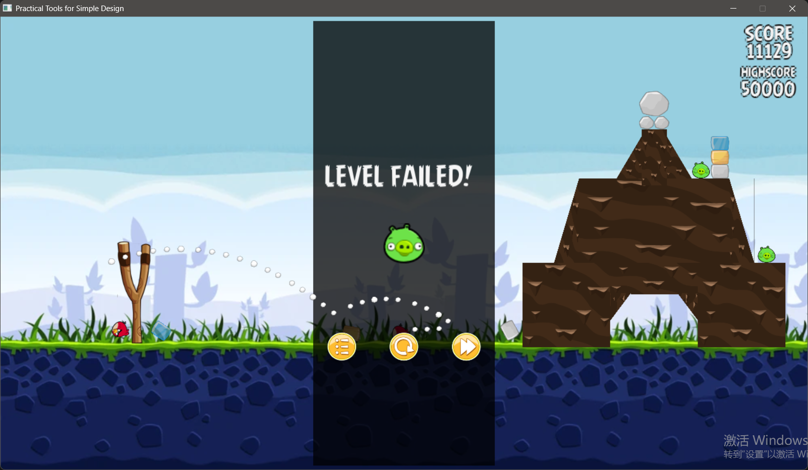 |
| 勝利結束畫面 | 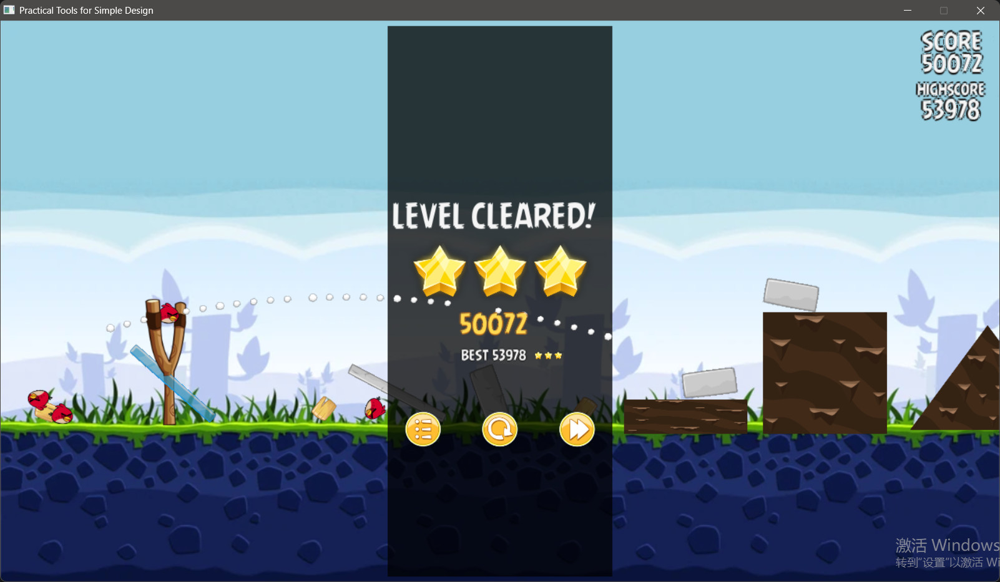 |

## 程式設計
### 程式架構

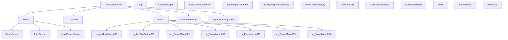

以下的點代表繼承、數字代表詳細解釋

- `Util::GameObject` - PTSD 框架中的遊戲物件基底類別
  - `Scene` - 場景基底類別，管理場景內的所有物件與物理更新
    - `GameScene` - 遊戲主場景，負責關卡載入、暫停選單、勝負判定
    - `IntroScene` - 介紹場景，包含主選單與設定介面
    - `LevelSelectScene` - 關卡選擇場景
  - `Character` - 遊戲角色類別，包含物理狀態、材質類型、傷害狀態
  - `Button` - UI 按鈕類別，處理滑鼠懸停與點擊事件
    - `AnimatedButton` - 動畫按鈕，支援縮放動畫效果
  - `DynamicBackground` - 動態背景，可設定移動速度實現視差效果

- `App` - 主應用程式類別，管理狀態機與場景切換
  1. 狀態包含：START（初始化）、UPDATE（主選單）、GAME（遊戲中）、END（結束）
  2. 管理 `m_loadingScene`、`m_introScene`、`m_levelSelectScene`、`m_gameScene`
  3. 處理關卡載入、重新開始、返回選單等操作

- `LevelManager` - 關卡管理器，負責解析 JSON 關卡資料並管理遊戲物件
  1. 從 JSON 檔案讀取關卡資訊（物件位置、縮放、旋轉等）
  2. 提供 `GetGameObjects()` 取得關卡中的所有物件

- `BirdLaunchController` - 鳥類發射控制器，處理彈弓拖曳與發射邏輯
  1. 管理鳥類隊列 (`m_BirdQueue`)
  2. 處理滑鼠拖曳，限制最大拉曳距離 (`maxPullDistance = 140.0f`)
  3. 根據鳥類質量調整發射速度以保持一致動能
  4. 當鳥類停止時自動切換到下一隻

- `SceneInputController` - 場景輸入控制器，處理相機平移與縮放
  1. 將滑鼠拖拉轉換為相機位移
  2. 處理滑鼠滾輪縮放，以滑鼠位置為中心

- `EntityTemplateDatabase` - 實體樣板資料庫，管理物件的物理屬性設定
  1. 從 `entity_templates.json` 載入樣板資料
  2. 支援字首匹配自動套用屬性（質量、材質、血量等）

- `LevelObjectFactory` - 關卡物件工廠，根據 JSON 資料動態生成 Character 實例
  1. 根據圖片 ID 分類 `EntityKind`（Bird、Pig、Environment、Slingshot）
  2. 根據圖片 ID 分類 `MaterialType`（Wood、Stone、Ice、Glass、Flesh）
  3. 套用樣板資料庫的預設值

- `CollisionUtils` - 碰撞檢測工具，實作 OBB 與 SAT 演算法
  1. 計算方向包圍盒 (OBB) 的最小平移向量 (MTV)
  2. 使用分離軸定理 (SAT) 進行精確碰撞偵測

- `CollisionResponse` - 碰撞響應處理，解析碰撞流形並施加衝量
  1. 實作 Warm Starting 機制提升堆疊穩定性
  2. 處理 Wake 機制，喚醒休眠物件
  3. 執行穿透修正防止物件穿透

- `ContactManifold` - 接觸流形，儲存碰撞接觸點資訊
  1. 包含法線向量、切線向量、穿透深度
  2. 累積法向衝量與切向衝量

- `BGM` - 背景音樂管理器
- `SoundEffect` - 音效播放器
- `Resource` - 資源管理系統，統一管理圖片、音效、關卡 JSON 的路徑

### 程式技術

#### 1. 畫面渲染與場景控制

- **場景管理**
  - 透過 `App` 類別實作狀態機架構，負責控制與切換不同場景 (如 `IntroScene`、`LevelSelectScene`、`GameScene`)。
  - 在 `GameScene` 中管理場景內的所有物件 (角色、環境、按鈕等)，並統一在 `Update` 中執行更新與渲染。
  - 實作 `SceneInputController` 負責處理玩家操作，將滑鼠拖拉動作轉換為相機位移，實現場景滾動與平移功能。
  - 整合 `DynamicBackground` 類別實作動態背景系統，可依據設定的移動速度實現視差捲動 (Parallax Scrolling) 效果，增加畫面豐富度。

- **物件與場景縮放**
  - 透過取得並動態調整相機縮放比例 (Zoom)，實現畫面的放大縮小效果。
  - 為了確保互動正確性，在處理滑鼠點擊與拖曳發射彈弓時，會將螢幕座標轉換回精準的縮放後世界座標 (`mousePos / zoom + cameraPos`)。
  - 對於物件尺寸縮放，在解析 JSON 關卡與版面資料時，支援直接對特定物件或群組設定縮放係數 (`scaleMultiplier`)，並在生成對應實體時套用。

#### 2. 物理引擎與核心機制

- **重力模擬**
  - 在 `Scene::Update` 的每個物理更新步階 (Physics Step) 中，統一對所有動態角色 (Dynamic Characters) 施加全域重力 (`kGlobalGravity = 700.0f * GetPhysicsScale()`)。
  - 重力會隨時間步長 (`dt`) 更新角色的垂直速度 (`v.y -= kGlobalGravity * dt`)。
  - 在正式施加重力前，會先執行多次「無重力位置鬆弛 (positional-only relaxation passes)」，以消除關卡初始化時可能造成的微小物件重疊，避免因重力疊加導致物件爆開的情形。

- **物理碰撞機制**
  - **結合 OBB 與 SAT 的高精度碰撞偵測**：
    - **外層形狀表示 (OBB, Oriented Bounding Box)**：遊戲內的環境物件與角色，在物理系統中主要由 OBB（方向包圍盒）或是特定多邊形（如斜坡的三角形）來描述。這允許物件在受物理力影響而自由旋轉時，依然能保有緊密且準確的碰撞邊界。
    - **底層偵測演算法 (SAT, Separating Axis Theorem)**：為了解決可旋轉 OBB 之間的碰撞問題，底層實作了分離軸定理 (SAT)。演算法會將兩個物件的頂點依序投影到各個潛在的分離軸上，藉此精確判斷是否發生交疊。若發生碰撞，SAT 也能同時計算出最小平移向量 (MTV, Minimum Translation Vector)，為後續的物理反應提供精確的法線與重疊深度。
  - 在 `CollisionResponse::SolveVelocity` 中解析碰撞流形 (Contact Manifold)，利用法線向量、切線向量與恢復係數 (Restitution) 計算並施加衝量 (Impulse) 以更新速度。
  - 實作 **Warm Starting (暖啟動) 機制**：在每個物理步階開始時，會預先套用上一幀的累積衝量，這項優化能大幅提升堆疊物件的穩定性，減少不自然的抖動。
  - 實作穿透修正 (Positional Correction) 機制，確保發生碰撞時重疊的物件能被正確推開，防止物件陷入地面或彼此穿透。
  - 實作「環境穩定化與休眠 (Stabilize & Sleep)」機制：在關卡載入初期會預先執行 120 步的物理加速運算 (`StabilizeEnvironment(120)`)，讓物件提前受重力與碰撞作用自然沉降；當物件的線速度與角速度低於特定閾值 (如 `settleSpeedThreshold`) 時，會將其標記為休眠狀態 (`Sleeping`) 強制靜止，以確保建築結構穩固並節省後續運算資源。同時也實作了 **Wake (喚醒) 機制**，讓休眠的物件在受到外部衝擊或失去幾何支撐時能被重新喚醒，恢復物理模擬。

- **材質驅動的破壞與傷害系統 (Material-Driven Destruction System)**
  - **材質多元特性 (`MaterialType`)**：為遊戲內的環境土塊 (Wood, Stone, Ice, Earth 等) 建立統一的材質列舉。此屬性在 `CollisionUtils` 中會被用來動態對應不同的摩擦係數 (Friction) 與恢復係數 (Restitution)，例如冰塊易滑動、石頭沉重且不回彈，讓不同材質的土塊具備獨特且真實的物理表現。
  - **衝量轉化傷害**：基於物理碰撞的法向衝量 (`absJn`) 大小計算傷害。當衝量大於特定的傷害閾值時，會結合該材質專屬的抗打擊能力 (`GetDamageResistance`) 計算出最終實際扣除的血量。
  - **傷害累積與延遲結算**：傷害會在求解器的多次迭代過程中先進行累積，並在單個物理步階結束時統一結算 (`ApplyAccumulatedDamage`)，避免傷害因迭代計算被異常放大。
  - **動態視覺破壞狀態**：物件具備多個受損階段 (`Undamaged` 到 `Critical`)，當血量跨越特定比例時，系統會動態替換土塊對應的圖片後綴 (如木頭從 `_1` 裂開變成 `_2`、`_3`)，呈現真實的材質破裂視覺效果。為確保關卡載入初期穩定，也設有傷害免疫計時器 (`m_DamageImmunityTimer`) 避免土塊在掉落沉降時互相擠壓破裂。

#### 3. 資料驅動架構

- **資源管理系統 (Resource Management)**
  - 透過 `Resource.hpp` 與 `Resource::GetPath` 統一宣告與管理所有遊戲資源的路徑（包含圖片、音效、關卡 JSON 等），避免在程式碼中散落硬編碼 (Hardcode) 的字串。
  - 提供統一的介面，能依據字串 ID 動態對應到正確的資源檔案路徑，大幅提升開發時素材替換與後續擴充的便利性及維護性。

- **物件屬性樣板系統 (Entity Template System)**
  - 建立 `EntityTemplateDatabase` 來管理遊戲角色的屬性設定。將各類物件（如紅鳥、木塊、冰塊、小豬等）的物理狀態（質量等）、材質種類（`MaterialType`）、實體類型（`EntityKind`）與初始血量等參數外部化，統一儲存於 JSON 格式的樣板資料庫中 (`entity_templates.json`)。
  - 支援字首匹配 (`matchPrefix`) 機制，只要載入物件的資源 ID 符合特定前綴，就能自動套用對應的物理屬性與設定，成功將物件的屬性設計與主程式碼解耦，讓企劃調整數值更加方便。

- **關卡生成與管理**
  - 使用 JSON 作為關卡資料格式，建立完整的關卡解析與動態生成系統。
    - 例如：關卡編號、關卡名稱、背景圖片、鳥類數量、群組調整以及物件資料都能透過 JSON 進行設定。
  - 建立 `LevelParser::Parse` 函式負責解析 JSON 檔案，讀取各種關卡資訊。
  - 在 `GameScene::LoadLevel` 中協調整體關卡載入流程。
    - 例如：重置相機、呼叫 `LevelManager::LoadLevel`、建立物理世界、計算地面高度與同步控制器。
  - 地圖中的所有物件皆由 JSON 的 `objects` 陣列讀取。
    - 每個物件都包含類型、位置、縮放、旋轉與圖片 ID 等資訊。
  - 使用工廠模式根據物件資料動態生成對應的 `Character` 實例，提升系統擴充性與維護性。
  - 實作角色動畫，發射抛物綫以及角色聲音。

#### 4. 遊戲邏輯與互動介面

- **鳥類發射機制 (Bird Launch Controller)**
  - 實作 `BirdLaunchController` 處理滑鼠拖曳彈弓發射鳥類的互動邏輯，並設有最大拉曳距離限制 (如 `maxPullDistance = 140.0f`)。
  - 具備動能一致性設計：在計算發射速度時，會根據鳥類的質量 (Mass) 進行動態縮放，確保不同體型的鳥類在相同拉力下具有一致的操作手感。
  - 內建鳥類隊列管理功能：當發射出去的鳥類停止運動或消失後，系統會自動切換並上膛下一隻鳥類。

- **勝負判定與計分系統**
  - 建立基於物理碰撞與角色摧毀狀態的動態計分系統。在 `Scene::Update` 中持續遍歷所有場景物件，檢查角色生命值是否小於等於 0。
  - 根據不同物件類型給予不同分數：消滅小豬 (`EntityKind::Pig`) 時獲得 100 分，破壞環境物件時獲得 10 分。為避免重複加分，會使用 `SetDestroyed(true)` 標記已計分物件。
  - 遊戲勝利條件：場上所有的小豬皆被消滅時，觸發勝利結算。
  - 遊戲失敗條件：當鳥類隊列耗盡，且所有發射的鳥類皆已停止運動，但場上仍有存活的小豬時，觸發失敗結算。
  - 將總分儲存在 `Scene` 類別的 `m_Score` 中，方便 UI 讀取與結算畫面展示。

- **遊戲介面**
  - 建立遊戲 HUD 與按鈕管理系統，負責遊戲中的互動介面。
  - 在 `GameScene::BuildLevelHud` 中建立各種按鈕。
    - 例如：暫停按鈕、重新開始按鈕、關卡選擇按鈕與靜音按鈕。
  - 每個按鈕皆透過 `SetOnClickFunction` 設定回調函式。
    - 例如：暫停按鈕會觸發 `TogglePauseMenu()`，重新開始按鈕則會呼叫 `m_OnRestartLevel`。
  - 使用 `App` 類別中的狀態機管理場景切換。
    - `GameScene` 會透過回調函式通知 `App` 執行狀態變更，例如重新開始關卡或回到關卡選擇畫面。
  - 建立完整的暫停選單系統。
    - 包含繼續遊戲、重新開始、關卡選擇與靜音功能。
  - 使用 `SetPauseMenuVisible` 控制暫停選單與覆蓋層的顯示與隱藏。
  - 製作游戲勝利介面。

## 結語
### 問題與解決方法
- **碰撞後衝量累積問題(大爆炸)**
  - **問題描述**：在目前的剛體衝量計算機制中，當一隻帶有高動能的鳥類撞擊密集的建築結構時，底層 SAT 碰撞引擎為了解決穿透問題，會瞬間產生並傳遞極大的法向衝量 (Normal Impulse)。這導致鳥類的單次撞擊破壞力過強，甚至會讓整座建築像發生大爆炸一樣向外噴飛。
  - **目前解法與侷限**：為了減緩這個問題，我們在 `CollisionResponse` 中對單次衝量設定了上限限制 (`kMaxNormalImpulse = 1200.0f`)，並將物理迭代中產生的傷害統一延遲到單個步階結束時結算，避免傷害被求解器的迭代次數異常放大。不過，目前單一隻鳥的破壞力仍稍嫌偏強，未來若要進一步改善，可考慮在撞擊瞬間對主動體施加額外的動能阻尼 (Damping) 或是動態調降群體碰撞時的恢復係數 (Restitution)。

- **物件穩定問題(持續互相碰撞至物件消失 / 靜止姿態不自然)**
  - **問題描述**：長條形的物件在掉落或受撞擊後，經常會出現不自然的旋轉停止狀態（例如：本該平躺在地上，卻因為微小的碰撞卡住而斜斜地插在地面或物件上靜止）。
  - **發生原因**：我們的環境穩定化機制 (`StabilizeEnvironment`) 採用了 120 步的逼近法，當物件的線速度與角速度低於閾值時便會強制進入休眠 (`Sleeping`)。然而，純衝量解算器 (Impulse-based Solver) 在處理微小穿透與邊角摩擦平衡時，角動量很容易因為頂點與地面的微小碰撞交疊而被瞬間抵銷，導致物件在還沒完全平躺前，速度就低於休眠閾值而被系統強制「定格」。
  - **目前解法與侷限**：我們實作了無重力位置鬆弛 (Positional Relaxation) 與 Warm Starting 預先套用衝量來提升建築初始堆疊的穩定度，並加入了 `SleepSupport` 檢查底部是否具有幾何支撐。這雖然解決了大部分的連續碰撞穿透問題，但要徹底解決物件斜插的問題，可能需要導入真實的約束解算器 (Constraint Solver，處理 Resting Contact) 或進一步調校休眠判斷的角速度門檻。

- **第二關與第十關特殊土塊 (碰撞模型與視覺不符)**
  - **問題描述**：在設計第二關與第十關時，負責關卡的組員遇到了一些形狀不規則的特殊土塊。為了方便，初期組員嘗試直接繪製並匯入一整塊不規則形狀的大型土塊圖片。但因為我們的物理系統目前只有針對基礎形狀（長方形、斜坡三角形等）撰寫碰撞偵測，導致這個「奇形怪狀」的圖片被系統直接視為一個巨大的長方形碰撞框，造成鳥類在畫面上會「撞到空氣」的奇怪現象。
  - **解決方法**：為了解決這個碰撞箱與視覺不符的問題，我們捨棄了直接匯入不規則大圖的作法，轉而善用專案內既有的 JSON 關卡讀取系統（該系統已預先實作了長寬獨立比例縮放與旋轉等功能）。改為使用多個基礎的方形與三角形土塊，藉由調整各種縮放與旋轉參數「拼湊」出原本不規則的特殊形狀，成功繞過了單一圖片形狀的碰撞限制，完美解決了碰撞偵測的問題。

### 自評
| 項次 | 項目                      | 完成 |
|:--:|-------------------------|:--:|
| 1  | 完成專案權限改為 public         | V  |
| 2  | 具有 debug mode 的功能       | V  |
| 3  | 解決專案上所有 Memory Leak 的問題 | ?  |
| 4  | 報告中沒有任何錯字，以及沒有任何一項遺漏    | V  |
| 5  | 報告至少保持基本的美感，人類可讀        | V  |

### 心得
- **111310452 黃安華**
  - 123
  - 123
  - 123
- **113590039 許兆雲**
  - 在這次製作 Angry Birds Replica 的過程中，我們深刻體會到遊戲開發的複雜性與挑戰性。專案採用 PTSD 框架作為基礎，我們學會了如何將遊戲邏輯與底層渲染、輸入系統解耦，透過 App 類別驅動狀態機，並將邏輯委派給特定的 Scene 實作 。在團隊合作方面，我們透過 Git 工作流與數位看板管理，有效分工處理物理模擬、關卡生成、計分系統等不同模組。雖然過程中遇到不少技術難題，如物件重置、物理數值調整等，但看到彈弓發射、結構倒塌、豬隻消滅的完整遊戲循環順利運作時，那份成就感是無法言喻的。這次專案不僅提升了我們的程式設計能力，更讓我們理解到創造一個完整遊戲世界所需的系統思維與細節打磨。

### 貢獻比例

<table>
  <thead>
    <tr>
      <th align="center">組員</th>
      <th align="center">工作內容</th>
      <th align="center">實作模組與系統邏輯</th>
      <th align="center">貢獻度</th>
    </tr>
  </thead>
  <tbody>
    <tr>
      <td rowspan="3" align="center">111310452 黃安華</td>
      <td>專案管理</td>
      <td>數位看板管理與 Git 工作流建置</td>
      <td rowspan="3" align="center">60%</td>
    </tr>
    <tr>
      <td>物件相依與架構設計</td>
      <td>底層系統架構與物件解耦設計</td>
    </tr>
    <tr>
      <td>物理模擬與碰撞系統</td>
      <td>多邊形物理模擬與 SAT 碰撞引擎</td>
    </tr>
    <tr>
      <td rowspan="3" align="center">113590039 許兆雲</td>
      <td>關卡生成與管理</td>
      <td>關卡資料解析與動態物件生成驅動器</td>
      <td rowspan="3" align="center">40%</td>
    </tr>
    <tr>
      <td>分數計算系統</td>
      <td>基於物理衝量之動態計分與空間 UI 系統</td>
    </tr>
    <tr>
      <td>遊戲介面</td>
      <td>遊戲狀態機與互動介面控制、遊戲特效、遊戲音效</td>
    </tr>
  </tbody>
</table>
