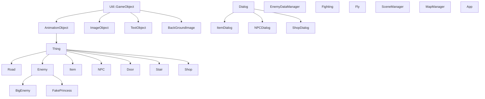

# 2026 OOPL Final Report

## 組別資訊
- 組別：48
- 組員：111310452 黃安華、113590039 許兆雲 
- 復刻遊戲：Angry Birds

## 專案簡介
### 遊戲簡介
- 
- 
### 

### 組別分工
- 

## 遊戲介紹
### 遊戲規則
- **攻略魔塔** - 按鍵
  - Space - 確認
  - 上下左右 - 操縱勇者移動
  - R - 重新開始
  - Q - 撤退（攻擊中使用）
  - S - 加速攻擊過程（攻擊中使用）
  - A - 讓勇者的攻擊力變為3571（再按一次回復原本的攻擊力）
    - 切換成Debug模式中所讓攻擊力上升，也會加在原本的攻擊力上，不會加在3571上
  - W - 查看功能列表（再按一次關閉功能列表）
- **攻擊規則**
  - 勇者攻擊1次，敵人攻擊1~3次（根據攻擊次數來定）
  - 勇者攻擊敵人
    - 傷害 = 勇者攻擊力 - 敵人防禦力
    - 特殊條件
      - 如果傷害 == 0 - 傷害 = 1
      - 會有（敵人敏捷）%的機會被敵人迴避攻擊
  - 敵人攻擊勇者
    - 傷害 = 敵人攻擊力 - 勇者防禦力
      - 如果敵人有無視防禦力的特殊能力，就不須扣掉勇者防禦力
    - 特殊條件
      - 如果傷害 <= 0 -> 傷害 = 1
      - 會有（勇者敏捷）%的機會被勇者迴避攻擊
      - 如果敵人有必殺攻擊的特殊能力，就有10%的機會直接被擊殺
      - 如果敵人有衰弱的特殊能力，就有1%的機會受到衰弱攻擊
      - 如果敵人有中毒的特殊能力，就有1%的機會受到中毒攻擊
        - 但我們做的遊戲關卡內沒有中毒攻擊的敵人
- **道具獎勵**
  - 上下左右 - 觸碰道具，獲得道具
- **NPC對話**
  - 上下左右 - 觸碰NPC，和NPC對話
- **開啟門**
  - 上下左右 - 觸碰門，判斷是否有對應鑰匙，開啟門
- **樓層上下**
  - 上下左右 - 從其他走道踩上樓梯，觸發上樓梯機制
- **商店購物**
  - 上下左右 - 觸碰商店(如果是三個連著的大商店，需觸碰中間的商店)，開啟商店選擇介面

### 遊戲畫面
|   階段   |                        遊戲畫面                        |
|:------:|:--------------------------------------------------:|
|  開始畫面  |    |
|  故事畫面  |    |
|  攻略魔塔  |    |
| NPC對話  |   |
|  敵人打架  |    |
|  打贏獎勵  |    |
|  領取道具  |    |
|  商店採買  |    |
| 查看敵人資料 |  |
|  樓層飛行  |    |
|  按鍵說明  |    |
|  巨大怪物  |    |
|  假公主   |     |
|  真公主   |     |
| 失敗結束畫面 |  |
| 勝利結束畫面 |  |

## 程式設計
### 程式架構

以下的點代表繼承、數字代表詳細解釋
- `Util::GameObject` - PTSD中的遊戲物件
  - `AnimationObject` - 動畫呈現的遊戲物件
    - `Thing` - 基礎地圖物件
      - `Road` - 地圖上的路跟牆
      - `Enemy` - 地圖上的敵人
        - `BigEnemy` - 地圖上的巨大敵人
        - `FakePrincess` - 地圖上的假公主
      - `Item` - 地圖上的道具
      - `NPC` - 地圖上的NPC
      - `Door` - 地圖上的門
      - `Stair` - 地圖上的樓梯和特殊樓梯
      - `Shop` - 地圖上的商店
  - `ImageObject` - 圖片呈現的遊戲物件
  - `TextObject` - 文字呈現的遊戲物件
  - `BackgroundImage` - 背景圖片 - 內涵切換背景的函式
- `Dialog` - 基礎對話框物件
  - `ItemDialog` - 獲得道具的對話框（可能會被NPC觸發）
  - `NPCDialog` - 跟NPC對話的對話框
  - `ShopDialog` - 商店購物的對話框
- `EnemyDataManager` - 查看敵人資料的介面
  1. 使用`EnemyData`複製一頁三個敵人資訊
- `Fighting` - 戰鬥介面
- `Fly` - 飛行介面
- `SceneManager` - 場景控制
- `MapManager` - 地圖控制、勇者觸碰其他物體
- `App` - 主遊戲架構

### 程式技術

- **關卡生成與管理**
  - 使用 JSON 作為關卡資料格式，建立完整的關卡解析與動態生成系統。
    - 例如：關卡編號、關卡名稱、背景圖片、鳥類數量、群組調整以及物件資料都能透過 JSON 進行設定。
  - 建立 `LevelParser::Parse` 函式負責解析 JSON 檔案，讀取各種關卡資訊。
  - 在 `GameScene::LoadLevel` 中協調整體關卡載入流程。
    - 例如：重置相機、呼叫 `LevelManager::LoadLevel`、建立物理世界、計算地面高度與同步控制器。
  - 地圖中的所有物件皆由 JSON 的 `objects` 陣列讀取。
    - 每個物件都包含類型、位置、縮放、旋轉與圖片 ID 等資訊。
  - 使用工廠模式根據物件資料動態生成對應的 `Character` 實例，提升系統擴充性與維護性。

- **分數計算系統**
  - 建立基於物理碰撞與角色摧毀狀態的動態計分系統。
  - 在 `Scene::Update` 中持續遍歷所有場景物件，檢查角色生命值是否小於等於 0。
  - 根據不同物件類型給予不同分數。
    - 例如：豬被消滅時加 100 分、環境方塊被摧毀時加 10 分。
  - 為避免重複加分，使用 `SetDestroyed(true)` 標記已計分物件。
    - 這樣可以避免物件在每一幀更新時重複累加分數。
  - 將總分儲存在 `Scene` 類別中的 `m_Score` 成員變數，方便 UI 與遊戲流程讀取。

- **遊戲介面按鈕**
  - 建立遊戲 HUD 與按鈕管理系統，負責遊戲中的互動介面。
  - 在 `GameScene::BuildLevelHud` 中建立各種按鈕。
    - 例如：暫停按鈕、重新開始按鈕、關卡選擇按鈕與靜音按鈕。
  - 每個按鈕皆透過 `SetOnClickFunction` 設定回調函式。
    - 例如：暫停按鈕會觸發 `TogglePauseMenu()`，重新開始按鈕則會呼叫 `m_OnRestartLevel`。
  - 使用 `App` 類別中的狀態機管理場景切換。
    - `GameScene` 會透過回調函式通知 `App` 執行狀態變更，例如重新開始關卡或回到關卡選擇畫面。
  - 建立完整的暫停選單系統。
    - 包含繼續遊戲、重新開始、關卡選擇與靜音功能。
  - 使用 `SetPauseMenuVisible` 控制暫停選單與覆蓋層的顯示與隱藏。

## 結語
### 問題與解決方法
- 亂數產生器感覺並不亂數
  - 因為我產生亂數種子應該放在程式執行的一開始，而不是要用到亂數當下的函式
- 假公主的繼承問題
  - 我在設計假公主的時候，發現假公主會先需要跟他對話，對話後封住後路並觸發戰鬥功能，因此我原本的設計是讓`FakePrincess`同時繼承`Enemy`和`NPC`，但發現這樣會造成菱形繼承的問題，因為`Enemy`和`NPC`都繼承了`Thing`，因此經過助教的建議後我改讓`FakePrincess`僅繼承`Enemy`，但在內部會有一個`NPC`的物件再讓`FakePrincess`自行控制是要觸發`Enemy`的`Touch`或是`NPC`的`Touch`。

### 自評
| 項次 | 項目                      | 完成 |
|:--:|-------------------------|:--:|
| 1  | 完成專案權限改為 public         | V  |
| 2  | 具有 debug mode 的功能       | ?  |
| 3  | 解決專案上所有 Memory Leak 的問題 | ?  |
| 4  | 報告中沒有任何錯字，以及沒有任何一項遺漏    | V  |
| 5  | 報告至少保持基本的美感，人類可讀        | V  |

### 心得
- **111310452 黃安華**
  - 123
  - 123
  - 123
- **113590039 許兆雲**
  - 123
  - 123
  - 123

### 貢獻比例

<table>
  <thead>
    <tr>
      <th align="center">組員</th>
      <th align="center">工作內容</th>
      <th align="center">實作模組與系統邏輯</th>
      <th align="center">貢獻度</th>
    </tr>
  </thead>
  <tbody>
    <tr>
      <td rowspan="3" align="center">111310452 黃安華</td>
      <td>專案管理</td>
      <td>數位看板管理與 Git 工作流建置</td>
      <td rowspan="3" align="center">60%</td>
    </tr>
    <tr>
      <td>物件相依與架構設計</td>
      <td>底層系統架構與物件解耦設計</td>
    </tr>
    <tr>
      <td>物理模擬與碰撞系統</td>
      <td>多邊形物理模擬與 SAT 碰撞引擎</td>
    </tr>
    <tr>
      <td rowspan="3" align="center">113590039 許兆雲</td>
      <td>關卡生成與管理</td>
      <td>關卡資料解析與動態物件生成驅動器</td>
      <td rowspan="3" align="center">40%</td>
    </tr>
    <tr>
      <td>分數計算系統</td>
      <td>基於物理衝量之動態計分與空間 UI 系統</td>
    </tr>
    <tr>
      <td>遊戲介面按鈕</td>
      <td>遊戲狀態機與互動介面控制</td>
    </tr>
  </tbody>
</table>
